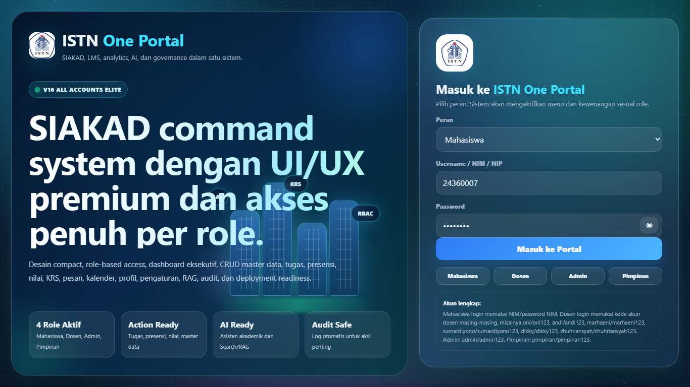
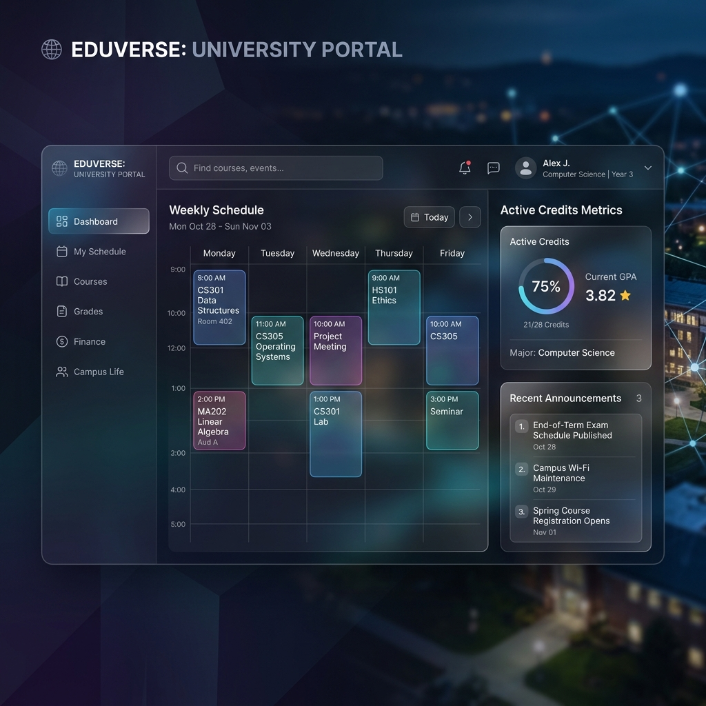
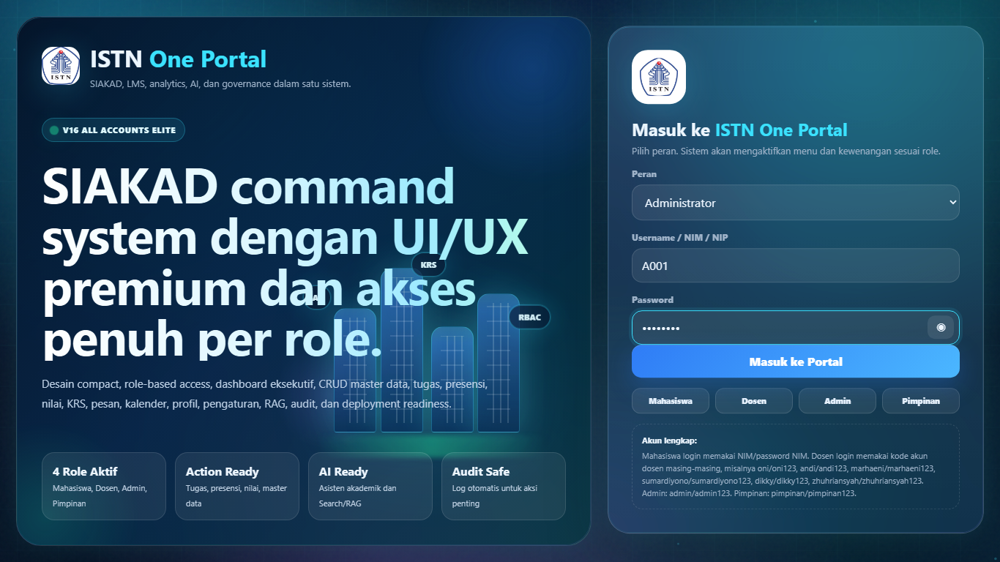
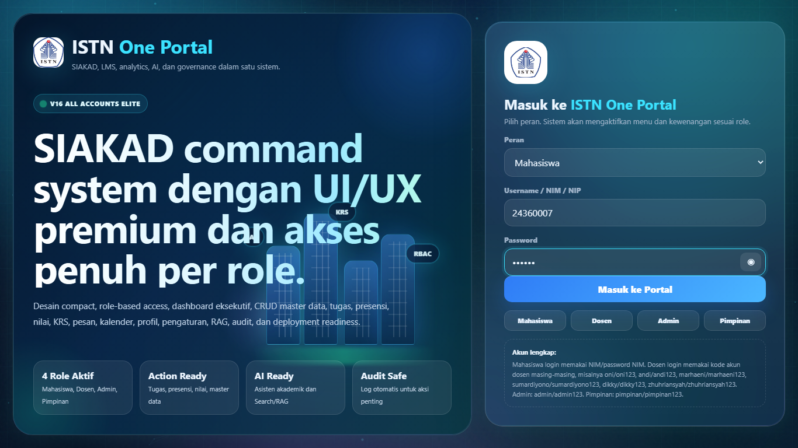
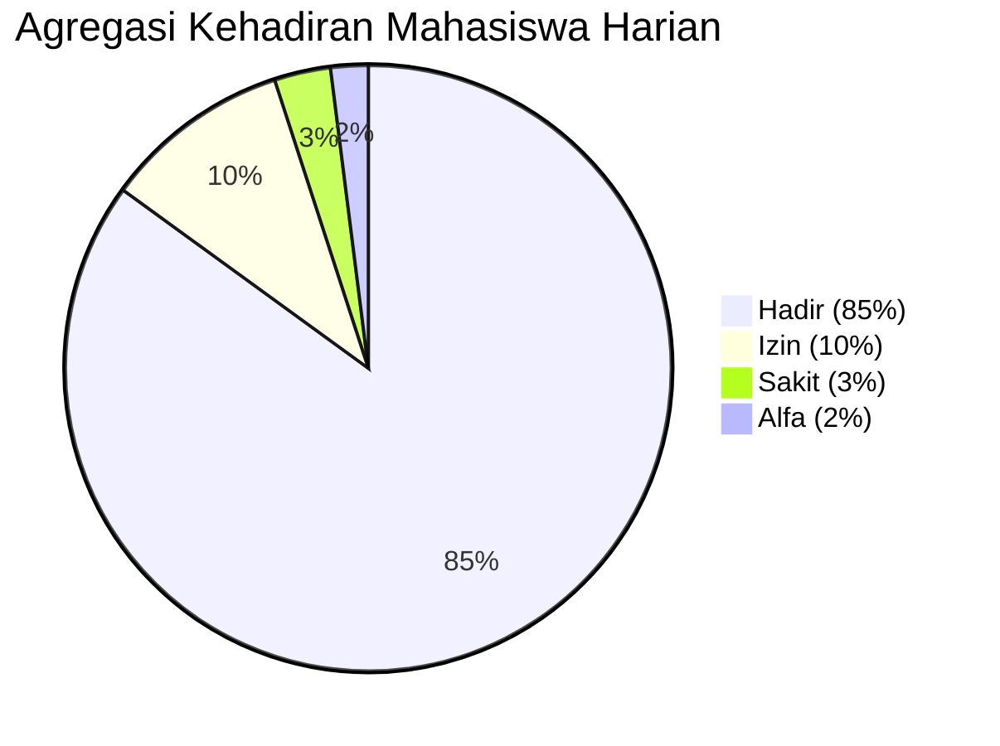
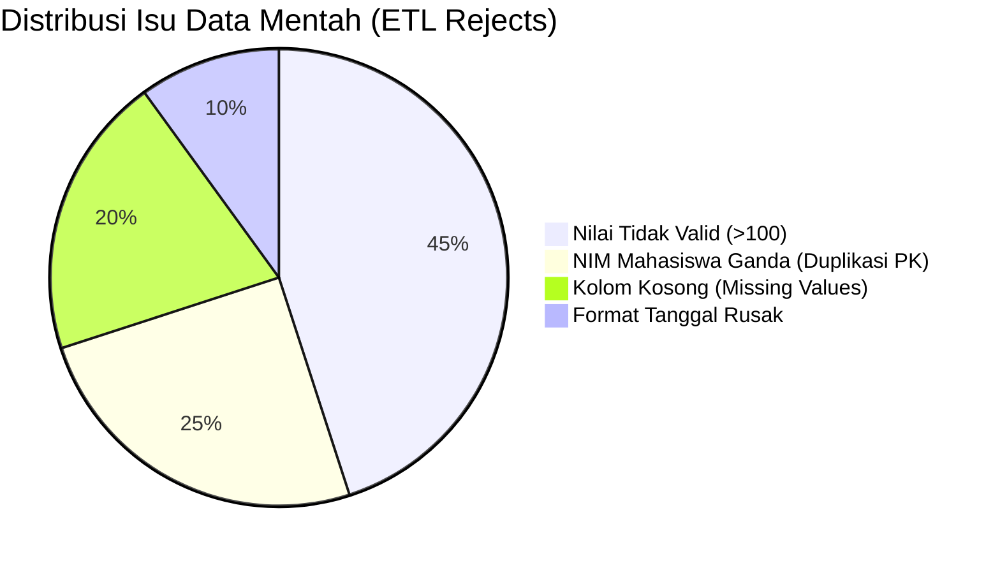
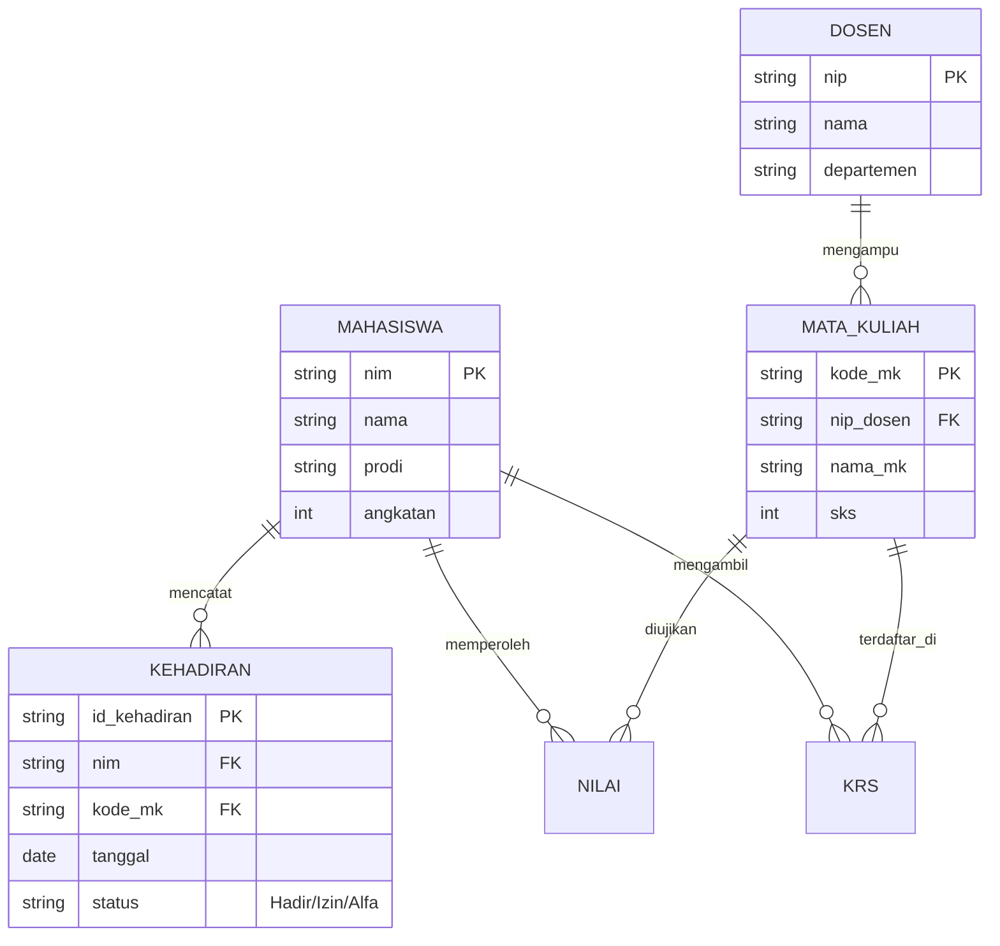

<div align="center">
  
  # 🎓 SC-DATA (Smart Campus Data & AI Assistant)
  **V16 All Accounts Elite — Infrastruktur Digital Kampus Berbasis Performa Tinggi**

  
  
  
  
  
  
</div>

<br/>

**SC-DATA** adalah sebuah purwarupa *Super App* dan *Command System* tingkat perusahaan (Enterprise) yang dirancang untuk menjadi tulang punggung digital perguruan tinggi modern. Berbeda dengan Sistem Informasi Akademik (SIAKAD) tradisional yang berjalan lambat dan terfragmentasi, SC-DATA menggabungkan **Mesin ETL**, **Database Analitik In-Memory**, **AI Semantic Search (RAG)**, dan **Layanan Mahasiswa Terpadu** dalam satu arsitektur berkinerja tinggi (*High-Performance Architecture*).

---

## 📸 Cuplikan Layar (Screenshots)

*(Catatan: Buat folder `docs/images/` dan unggah file gambar Anda ke sana agar gambar di bawah ini muncul)*

<div align="center">
  
  
</div>
<br/>
<div align="center">
  
  
</div>

---

## 📑 Daftar Isi
1. [Arsitektur Sistem (3-Tier)](#1-arsitektur-sistem-3-tier)
2. [Visualisasi Data Analytics](#2-visualisasi-data-analytics)
3. [Ekosistem Fitur & Modul Utama](#3-ekosistem-fitur--modul-utama)
4. [Skema Database Utama (ER Diagram)](#4-skema-database-utama-er-diagram)
5. [Keamanan & Tata Kelola (RBAC)](#5-keamanan--tata-kelola-rbac)
6. [Panduan Instalasi & Deployment](#6-panduan-instalasi--deployment)
7. [API Endpoints Reference](#7-api-endpoints-reference)

---

## 🏗️ 1. Arsitektur Sistem (3-Tier)

Sistem ini menghindari penggunaan *framework* SSR (*Server-Side Rendering*) yang berat seperti Streamlit demi mencapai antarmuka yang 100% interaktif (*Zero-Latency UI*). Arsitektur dirancang menjadi tiga lapisan (*tier*) independen:

```mermaid
flowchart TD
    subgraph TIER1 [PRESENTATION LAYER]
        UI["Visual UI (HTML5 + CSS Glassmorphism)"]
        Logic["Client Logic (Vanilla JavaScript)"]
    end

    subgraph TIER2 [APPLICATION LAYER]
        Gateway["FastAPI Gateway"]
        Business["Business Logic & Security (RBAC)"]
    end

    subgraph TIER3 [DATA LAYER]
        Engine[("DuckDB (In-Process OLAP)")]
        Raw["Raw Data (CSV & TXT)"]
    end

    UI <==>|HTTP REST (JSON)| Gateway
    Gateway <==>|SQL Queries| Engine
```

---

## 📊 2. Visualisasi Data Analytics

Sistem secara otomatis mengubah jutaan baris log absensi dan integritas data menjadi grafik analitik untuk pimpinan kampus.

### Distribusi Kehadiran (*Real-Time Event Monitor*)
Grafik ini mewakili pemantauan trafik *event_log* yang masuk ke dalam DuckDB secara seketika.



### Karantina Data ETL (*Data Quality Issues*)
Grafik ini memetakan jenis error yang paling sering terdeteksi oleh mesin ETL dan ditolak (*quarantined*) ke `pipeline_issue_log`.



---

## 🚀 3. Ekosistem Fitur & Modul Utama

SC-DATA merangkum **Siklus Hidup Mahasiswa 360 Derajat**, dibagi ke dalam 5 pilar fungsional:

### A. Rekayasa Data & Infrastruktur (Data Engineering)
- **Data Pipeline Builder (ETL)**: Memproses 6 set CSV dengan proteksi *Auto-Quarantine* jika mendeteksi anomali.
- **Real-Time Event Monitor**: Endpoint ingestion simulasi *streaming* absensi. 
- **Self-Validation System**: API bawaan yang mengaudit kesehatan database tanpa internet.

### B. Eksekusi Akademik
- **Dasbor KRS & Jadwal Mingguan**: Matriks visual jadwal kuliah dalam format *time-block*.
- **Auto-Generasi Dokumen (Paperless)**: Merender **Kartu Ujian Digital** dan **Surat Keterangan Aktif** ke format PDF siap cetak.

### C. Manajemen Finansial & Fasilitas
- **Modul SPP/UKT**: Pencatatan riwayat tagihan, metode pembayaran, dan metrik Lunas vs Tunggakan.
- **Perpustakaan Digital**: Katalog fisik perpustakaan dan akses E-Book eksternal.

### D. Akselerator Karir Mahasiswa
- **Pusat PKL/Magang & Skripsi**: *Tracking* 3 fase bimbingan skripsi dan lokasi magang perusahaan.
- **Bursa Beasiswa & Tracer Study**: Daftar kuota KIP/Beasiswa dan pelacakan karir alumni.

### E. Ekosistem Sosial & Komunikasi
- **Forum Diskusi Akademik**: Wadah tanya jawab ala StackOverflow.
- **Helpdesk Ticketing**: Pusat pelaporan insiden IT/Akademik.

---

## 🗄️ 4. Skema Database Utama (ER Diagram)

Sistem basis data dimuat otomatis oleh `init_db.py` ke dalam `sc_data.duckdb`. Berikut adalah relasi antar tabel utamanya:



*Catatan: Tersedia juga tabel non-relasional untuk logging seperti `event_log`, `pipeline_issue_log`, `audit_log`, dan `document_chunks` (Untuk vektor teks AI).*

---

## 🛡️ 5. Keamanan & Tata Kelola (RBAC)

Aplikasi ini menggunakan metode **Role-Based Access Control (RBAC)** secara tegas:
- **4 Role Absolut**: `Mahasiswa`, `Dosen`, `Administrator`, `Pimpinan`.
- **Backend Guard**: Endpoint kritis dikunci menggunakan *dependency injection* `require_admin`. Upaya meretas sistem via API tanpa token Admin ditolak dengan `403 Forbidden`.
- **Immutable Audit Trail (`audit_log`)**: Setiap transaksi (Login, Eksekusi ETL, RAG) dicatat presisi (Siapa pelakunya, Modul, Jam) untuk forensik.

---

## 💻 6. Panduan Instalasi & Deployment

Proyek ini menggunakan pendekatan **Local-First / Edge Compute**.

### Langkah Menjalankan Aplikasi
1. **Kloning Repositori**
   ```bash
   git clone https://github.com/Maxodus126/PROJECT_FINAL_SISTEMBASISDATA.git
   cd PROJECT_FINAL_SISTEMBASISDATA
   ```

2. **Instalasi Dependencies (Backend)**
   ```bash
   pip install fastapi uvicorn duckdb
   ```

3. **Menyalakan Server Backend (API)**
   ```bash
   cd backend
   uvicorn main:app --reload --host 127.0.0.1 --port 8000
   ```
   *(Backend berjalan di `http://localhost:8000`)*

4. **Menyalakan Frontend (UI)**
   Buka file `frontend/index.html` menggunakan browser Anda.

### Menggunakan Akun Sandbox (Mockup)
- **Mahasiswa**: `24360007` | **Admin**: `A001` | **Dosen**: `D001` | **Pimpinan**: `P001` *(Password bebas)*

---

## 🔌 7. API Endpoints Reference

| HTTP Method | Endpoint | Fungsi | Role |
|-------------|----------|--------|------------|
| `POST`      | `/api/events/load` | Menyimulasikan aliran batch absen terbaru | Admin |
| `POST`      | `/api/pipeline/run` | Menjalankan mesin ETL memproses 6 CSV | Admin |
| `GET`       | `/api/rag/search?q=...` | AI Semantic Search dokumen akademik | - |
| `GET`       | `/api/validation/final` | Memeriksa integritas sistem 100% | - |

---
*Dikembangkan dengan penuh ketelitian oleh Aflin Awaludin sebagai Final Project Sistem Basis Data - Institut Sains dan Teknologi Nasional (ISTN).*
